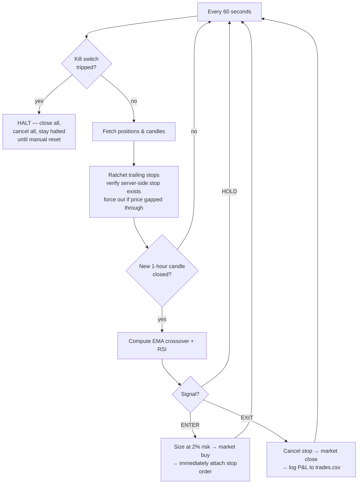

# momentum-bot

A production-grade, automated **crypto momentum / trend-following** trading bot
for [Alpaca](https://alpaca.markets/). Trades long-or-flat on a dual-EMA
crossover confirmed by RSI, with server-side hard stops, trailing stops, a
daily kill switch, and exposure caps enforced in a dedicated risk module.

> **The bot defaults to Alpaca's PAPER endpoint.** Going live requires two
> explicit environment variables (see the [go-live checklist](#6-go-live-checklist)).
> If either is missing it runs on paper and logs a loud warning.

momentum-bot is a **headless terminal application** — there is no GUI, so the
"screenshots" below are captures of what it prints to your terminal. That's
the whole interface: logs to stdout, trades to `trades.csv`, and optional
Discord/Telegram pings to your phone.

---

## Contents

1. [What it does](#1-what-it-does)
2. [Installation](#2-installation)
3. [Usage — running the bot](#3-usage--running-the-bot)
4. [Usage — backtesting](#4-usage--backtesting)
5. [Deployment (Docker / Railway)](#5-deployment-docker--railway)
6. [Go-live checklist](#6-go-live-checklist)
7. [Configuration reference](#7-configuration-reference)
8. [Troubleshooting](#8-troubleshooting)
9. [Risk disclaimer](#9-risk-disclaimer)

---

## 1. What it does

### Strategy

- **Signal:** 20-period fast EMA vs 50-period slow EMA on **1-hour** candles.
- **Entry (long only):** fast EMA crosses **above** slow EMA **and** RSI(14)
  is between **50 and 70** (filters weak and overextended breakouts).
- **Exit:** fast EMA crosses below slow EMA, **or** the trailing stop is hit,
  **or** the hard stop is hit.
- **No shorting. No pyramiding.** One open position per symbol, max.

The signal logic lives entirely in `strategy.py` as **pure functions** (candles
in, signal out), so the backtester and the live bot run *identical* code.

### How the loop works



### Risk management (enforced in `risk.py`)

| Control | Default | Behaviour |
|---|---|---|
| Position sizing | 2% equity/trade | Size derived from the stop distance so a stop-out loses ~2% of equity |
| Hard stop | 3% below entry | A **real server-side stop-limit order** at Alpaca (2% limit band), not tracked in memory; a per-cycle gap check forces a market exit if price blows through the band unfilled |
| Trailing stop | activate +4%, trail 2.5% | Ratchets the server-side stop up as price rises; never moves down; the bot re-verifies a live stop exists every cycle |
| Daily kill switch | −5% from day start | Closes all positions, cancels all orders, halts. **Persists across restarts and day rolls** until you reset it with `--reset-kill-switch` |
| Max total exposure | 50% of equity | Never more than half of equity deployed across all positions |
| Order sanity checks | 25% / 5 min | Rejects orders > 25% of equity or when candle data is stale |

Because stops live **server-side at Alpaca**, a crash, redeploy, or SIGTERM
never leaves a position unprotected. The bot does **not** auto-close on
shutdown — positions stay open with their stops in place.

### Project layout

```
momentum-bot/
├── main.py        # entry point + main loop (poll every 60s; act on candle close)
├── config.py      # every tunable from env vars, safe paper-mode defaults
├── strategy.py    # pure EMA/RSI signal functions (no I/O)
├── risk.py        # sizing, stops, kill switch, exposure caps (pure + manager)
├── broker.py      # Alpaca wrapper: account, candles, orders, positions
├── state.py       # SQLite state + trades.csv ledger; day-start equity; kill switch
├── logger.py      # structured logging + optional Discord/Telegram notifier
├── backtest.py    # same strategy.py functions over historical candles
├── tests/         # pytest: signals, sizing math, kill switch, exposure, staleness
├── requirements.txt
├── Dockerfile / .dockerignore
├── railway.toml
├── .env.example
└── README.md
```

---

## 2. Installation

**Requirements:** Python 3.11+ and a free Alpaca account.

### Step 1 — Get Alpaca paper keys

1. Sign up at <https://alpaca.markets/> (free).
2. Open the **paper** dashboard: <https://app.alpaca.markets/paper/dashboard/overview>.
3. Top-right → **View API Keys** → generate. Copy the key and secret.

Paper keys trade a simulated account with fake money. Perfect — start there.

### Step 2 — Install

```bash
git clone <your-repo-url>
cd momentum-bot

python -m venv .venv
source .venv/bin/activate          # Windows: .venv\Scripts\activate

pip install -r requirements.txt
```

### Step 3 — Configure

```bash
cp .env.example .env
```

Open `.env` and paste your paper keys:

```ini
ALPACA_API_KEY=PKXXXXXXXXXXXXXXXXXX
ALPACA_API_SECRET=xxxxxxxxxxxxxxxxxxxxxxxxxxxxxxxxxxxx
TRADING_MODE=paper
I_UNDERSTAND_REAL_MONEY=no
```

Leave everything else at its defaults to start. `.env` is gitignored and
docker-ignored — it never leaves your machine.

### Step 4 — Verify with the test suite

No keys or network needed:

```bash
pytest
```

You should see:

```text
55 passed in 0.76s
```

---

## 3. Usage — running the bot

```bash
python main.py
```

That's it — `.env` is loaded automatically. The bot reconciles against your
Alpaca account, then checks stops every 60 seconds and evaluates signals each
time an hourly candle closes. Leave it running (see
[Deployment](#5-deployment-docker--railway) for 24/7 operation).

### 📸 What you'll see: startup

Real capture — this is the safety gate refusing to go live because only one
of the two live-mode flags was set:

```text
2026-07-10T17:27:59+0000 WARNING momentum-bot | Running in PAPER mode (TRADING_MODE=live but I_UNDERSTAND_REAL_MONEY!=yes). No real money at risk.
2026-07-10T17:27:59+0000 INFO    momentum-bot | config loaded | symbols=['BTC/USD', 'ETH/USD'] mode=PAPER ema_fast=20 ema_slow=50 rsi=(50.0, 70.0) risk_per_trade=0.02
```

With keys configured, boot continues:

```text
2026-07-10T14:00:01+0000 INFO    momentum-bot | reconciling local state against Alpaca...
2026-07-10T14:00:02+0000 INFO    momentum-bot | reconcile complete: 0 live position(s)
2026-07-10T14:00:02+0000 INFO    momentum-bot | entering main loop (poll every 60s)
```

### 📸 What you'll see: a normal cycle

Once per minute, a one-line health snapshot; once per hour, the signal
evaluation per symbol (example output):

```text
2026-07-10T15:00:04+0000 INFO    momentum-bot | signal | symbol=BTC/USD signal=HOLD reason=no_cross price=118432.5 fast_ema=118120.44 slow_ema=118355.12 rsi=48.3
2026-07-10T15:00:05+0000 INFO    momentum-bot | signal | symbol=ETH/USD signal=ENTER_LONG reason=ema_cross_up_rsi_ok price=3421.75 fast_ema=3398.21 slow_ema=3396.9 rsi=61.2
2026-07-10T15:00:05+0000 INFO    momentum-bot | ENTER ETH/USD qty=0.58390000 @~3421.75 stop=3319.10 (ema_cross_up_rsi_ok)
2026-07-10T15:00:11+0000 INFO    momentum-bot | cycle | equity=10000.0 day_start=10000.0 exposure=1998.06 unrealized_pl=0.0 open_positions=['ETH/USD']
```

### 📸 What you'll see: the kill switch firing

```text
2026-07-10T21:34:07+0000 CRITICAL momentum-bot | KILL SWITCH: equity 9480.11 is 5.2% below day start 10000.00. Closing all, halting.
2026-07-10T21:35:07+0000 CRITICAL momentum-bot | TRADING HALTED (kill switch). Reason: KILL SWITCH: ... Restart with --reset-kill-switch (or RESET_KILL_SWITCH=yes) to resume.
```

The halt **persists across restarts and UTC day rolls** — the bot will not
quietly resume. When you've reviewed what happened and want to trade again:

```bash
python main.py --reset-kill-switch
```

### Every trade is logged to `trades.csv`

```csv
timestamp,symbol,side,qty,entry,exit,stop,pnl,reason_entry,reason_exit
2026-07-10T15:00:08+00:00,ETH/USD,BUY,0.5839,3422.10,,3319.44,,ema_cross_up_rsi_ok,
2026-07-11T03:00:09+00:00,ETH/USD,SELL,0.5839,3422.10,3561.80,3472.76,81.58,,ema_cross_down
```

The same ledger is kept in SQLite (`state.db`, table `trades`) for querying.

### Optional: trade notifications on your phone

Set one of these in `.env` and the bot pings you on every entry, exit,
trailing-stop raise, and kill-switch event:

```ini
DISCORD_WEBHOOK_URL=https://discord.com/api/webhooks/...
# or
TELEGRAM_BOT_TOKEN=123456:ABC...
TELEGRAM_CHAT_ID=987654321
```

---

## 4. Usage — backtesting

```bash
python backtest.py --symbol BTC/USD --days 180 --fee-bps 25
```

Flags: `--symbol` (default `BTC/USD`), `--days` (default `180`),
`--cash` (starting equity, default `10000`), `--fee-bps` (fee per side in
basis points; Alpaca's crypto taker fee is ~25 bps — use it for honest
numbers).

### 📸 What you'll see

Real capture of the report format (this run used synthetic data, so the
numbers are illustrative — run it yourself for real ones):

```text
============================================================
  BACKTEST RESULTS — BTC/USD  (90 days, 1h candles)
============================================================
  Initial equity               $10,000.00
  Final equity                 $10,282.38
  Total return                     +2.82%
  Max drawdown                      3.71%
  Win rate                  38.5%  (5/13)
  Profit factor                      2.02
  Number of trades                     13
============================================================
  BENCHMARK — buy & hold
  Buy & hold return               +31.64%
  Strategy vs B&H                -28.82%  (UNDERPERFORMED)
============================================================
  NOTE: the strategy did NOT beat simply holding over this
  window. Momentum systems lag in trending/choppy regimes.
  Fees modeled at 25 bps per side. Slippage is NOT
  modeled; real results will be somewhat worse.
============================================================
```

### Interpreting the results

- **Profit factor** — gross wins ÷ gross losses. Below 1 lost money; above
  ~1.5 is respectable. Be suspicious of anything that looks too good on a
  single symbol/window.
- **Max drawdown** — your emotional stress test. Could you watch this happen
  with real money and not intervene?
- **vs Buy & hold** — the verdict line is printed honestly, including when the
  strategy loses to simply holding (common in strong bull runs). One good
  window is not an edge: test several windows and symbols.
- **Fills are idealized** — entries at candle close, stop exits at the stop
  price. Pass `--fee-bps 25`; slippage is still unmodeled, so expect live
  results to be somewhat worse.

---

## 5. Deployment (Docker / Railway)

### Docker (any host)

```bash
docker build -t momentum-bot .
docker run -d --name momentum-bot \
  --env-file .env \
  -e STATE_DB_PATH=/app/data/state.db \
  -e TRADES_CSV_PATH=/app/data/trades.csv \
  -v momentum-data:/app/data \
  momentum-bot

docker logs -f momentum-bot     # watch it work
```

The image runs as a non-root user, and `.dockerignore` keeps `.env`, state,
and ledgers out of the image itself.

### Railway (managed, ~1 minute of clicking)

1. Push this project to a GitHub repo.
2. In [Railway](https://railway.app/): **New Project → Deploy from GitHub repo**.
   Railway detects the `Dockerfile` and `railway.toml` and builds a
   long-running worker (no port needed).
3. **Variables** tab: set `ALPACA_API_KEY`, `ALPACA_API_SECRET`, and keep
   `TRADING_MODE=paper` / `I_UNDERSTAND_REAL_MONEY=no` to start. Add any
   overrides and (optionally) `DISCORD_WEBHOOK_URL`.
4. **Persist state:** add a Volume mounted at `/app/data`, then set
   `STATE_DB_PATH=/app/data/state.db` and `TRADES_CSV_PATH=/app/data/trades.csv`
   so the ledger and kill-switch status survive redeploys.
5. Deploy. On each redeploy Railway sends `SIGTERM`; the bot persists state
   and exits cleanly, leaving positions open with stops live at Alpaca. On
   boot it reconciles against Alpaca (the source of truth).

> To reset a kill-switch halt on Railway: set `RESET_KILL_SWITCH=yes`, let it
> redeploy once, then **remove the variable** so a future halt isn't silently
> cleared by the next restart.

---

## 6. Go-live checklist

**Do not set the live flags until every box is checked.**

- [ ] Run **2–4 weeks minimum of profitable paper trading** in the exact
      configuration you intend to run live.
- [ ] Read the entire `trades.csv` ledger. **Understand every single loss** —
      why it entered, why it exited, whether the stop behaved as designed.
- [ ] Confirm the kill switch fired correctly at least once (temporarily lower
      `DAILY_KILL_PCT` on paper to force it), that it halted trading, that a
      plain restart did NOT resume trading, and that `--reset-kill-switch` did.
- [ ] Verify stops exist server-side in the Alpaca dashboard while positions
      are open.
- [ ] Re-run the backtest across several windows and symbols with
      `--fee-bps 25`; confirm you are comfortable with the drawdowns.
- [ ] Decide the **real money** you can afford to lose entirely — fund the
      live account with only that.
- [ ] **Only then** set both:
      ```ini
      TRADING_MODE=live
      I_UNDERSTAND_REAL_MONEY=yes
      ```
      and switch to **live** API keys from the Alpaca live dashboard.

---

## 7. Configuration reference

Everything is an environment variable (or a `.env` line). Defaults are safe.

| Variable | Default | Meaning |
|---|---|---|
| `ALPACA_API_KEY` / `ALPACA_API_SECRET` | — | Your Alpaca keys (paper keys for paper mode) |
| `TRADING_MODE` | `paper` | Must be `live` **and** the flag below set to trade real money |
| `I_UNDERSTAND_REAL_MONEY` | `no` | Second half of the live-mode gate; must be `yes` |
| `SYMBOLS` | `BTC/USD,ETH/USD` | Comma-separated pairs; `BTCUSD` form is auto-normalized |
| `TIMEFRAME_HOURS` | `1` | Candle size in hours |
| `EMA_FAST` / `EMA_SLOW` | `20` / `50` | Crossover periods |
| `RSI_PERIOD` | `14` | RSI lookback |
| `RSI_LOW` / `RSI_HIGH` | `50` / `70` | Entry allowed only inside this band |
| `RISK_PER_TRADE` | `0.02` | Fraction of equity risked per trade |
| `HARD_STOP_PCT` | `0.03` | Hard stop distance below entry |
| `TRAIL_ACTIVATE_PCT` | `0.04` | Gain required before the trail arms |
| `TRAIL_PCT` | `0.025` | Trail distance below the high-water mark |
| `DAILY_KILL_PCT` | `0.05` | Daily drawdown that trips the kill switch |
| `MAX_EXPOSURE_PCT` | `0.50` | Cap on total deployed equity |
| `MAX_ORDER_PCT` | `0.25` | Cap on any single order's notional |
| `MAX_DATA_STALENESS_SEC` | `300` | Reject entries when candle data is older than this |
| `MIN_NOTIONAL` | `1.0` | Smallest order value worth submitting |
| `POLL_INTERVAL_SEC` | `60` | Stop/kill-switch check cadence |
| `STATE_DB_PATH` / `TRADES_CSV_PATH` | `state.db` / `trades.csv` | Where state and the ledger live |
| `RESET_KILL_SWITCH` | — | Set to `yes` for one boot to clear a halt, then unset |
| `DISCORD_WEBHOOK_URL` | — | Optional trade/alert notifications |
| `TELEGRAM_BOT_TOKEN` / `TELEGRAM_CHAT_ID` | — | Optional Telegram notifications |
| `LOG_LEVEL` / `LOG_JSON` | `INFO` / `false` | Verbosity; `LOG_JSON=true` for structured JSON logs |

CLI flags: `python main.py --reset-kill-switch` · `python backtest.py --symbol X --days N --cash N --fee-bps N`

---

## 8. Troubleshooting

**"ALPACA_API_KEY / ALPACA_API_SECRET not set"** — copy `.env.example` to
`.env` and paste your paper keys, or export them in your shell.

**"Running in PAPER mode (TRADING_MODE=live but I_UNDERSTAND_REAL_MONEY!=yes)"**
— that's the safety gate working. Both variables are required to go live.

**"TRADING HALTED (kill switch)"** on every cycle — the daily −5% halt tripped
at some point and it persists deliberately. Review `trades.csv`, understand
what happened, then restart with `--reset-kill-switch`.

**"insufficient bar data"** — usually a wrong symbol (must be a pair Alpaca
lists, e.g. `SOL/USD`) or no network access to `data.alpaca.markets`.

**Backtest says "Not enough candles"** — the symbol/date range returned fewer
than ~52 hourly candles; check the symbol spelling and shorten `--days` only
if the asset is newly listed.

**Bot restarted — did I lose anything?** No. On boot it reconciles with
Alpaca: adopts any position it finds, re-arms missing stops, and books
positions that closed while it was down into the ledger.

---

## 9. Risk disclaimer

This software is provided for educational purposes and comes with **no warranty
of any kind**. Trading cryptocurrencies involves substantial risk of loss.

- **Momentum strategies lose money in choppy, sideways markets** — they buy
  breakouts that reverse and get repeatedly stopped out ("whipsawed").
- **Past backtest performance does not predict future results.** Backtests
  idealize fills, ignore slippage, and can overfit to a particular window.
- Automated systems fail in ways you don't expect: exchange outages, data
  gaps, API changes, bugs. Stops can slip or gap in fast markets.
- **Only trade money you can afford to lose entirely.** You are solely
  responsible for your own trading decisions and any losses incurred.
